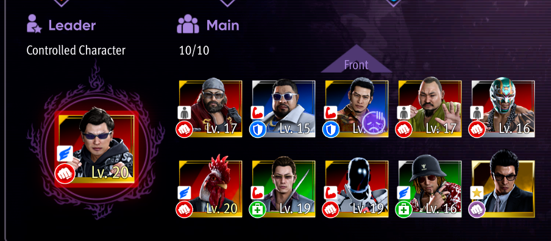

# Gaiden All Substories notes (differences from any%)
### Chapter 2
- After talking to homeless guy (going to parking lot), go to pool and do one hit easy & first shot of normal diff, buy golden ball for 777 points
- Golden ball if boat appears after the fight at the footwalk (pay attention to the boat golden ball for the rest of your run if you don't get it here)
- After club visit pick every single request you have available and progress any% as normal
- Pick the extra platinum plate locker key on sotenbori st. (can pickup the tauriner maximum as well)
- Normal any% until locker keys, pick locker keys, equip binding, level up and go to parking lot (use cone?), then footpath fight (use ex heat), then hornet
- after cigarete taxi to East Bunzaemon fight red guys -> ebisu pawn (buy golden ball)
- red fight before going to akame
- go to akame
- after going back fight the leader before the apartment setpiece
- When doing the silver matchups for the golden tiget do the extra silver hell rumble

> Note: We don't really need that many of the max heat items for the finale as we gonna pick eternal life option from the golden ball substory, which essentially gives you like 25 tauriner maxes (100x Nourishments). So either use them somewhere else when you run out of heat, or just don't pick them up at all

### Chapter 3
- Pick everything
- Level up points earn 1 time and shop once (saves menuing doesn't matter that much)
- Substories:
    - Taxi to Bishamon bridge (you need to have 1 mil if you don't start with convinience clerk or defeat the samurai) 
    - Liberate the hammer man (after saying you pay the 1 mil level up the stuff we normally do in the any% run + maybe more dmg)
    - Strongest convinience clerk
    - Start A simple heavy lifting job
    - Homeless Yomaka
    - somewhere in between golden samurai
    - Final Showdown: Red Peacocks
- Go to akame, binding event, pick every new substory
- Substories:
    - Taxi to E Bunzaemon
    - Cat loving rapper start
    - walk to E sotenbori footpath, cat lover progress fight, start white gang
    - taxi to Shofukucho
    - Hostess start
    - Smile Burger substories (Needing advice, Film assistent needed)
    - After smile burger go right and do another white gang fight
    - Taxi to iwao bridge (or just walk?), needs advice progress, wrestler start
    - Taxi to W Sotenbori, start hostess
    - Taxi to E Sotenbori St.
    - Fake ryuji start, talk to person for wrestler
    - Taxi to Shofukucho, all the things behind you go as far as W shofukucho
    - Progress the substory with kaito last
    - Go behind you, cat loving rapper, wrestler, end on S shofukucho ryuji thing
    - Taxi to E. Sotenbori
    - Finish White gang and progress wrestler
    - Taxi to castle
    - Note: You should fight golden samurai again at some point, plenty of opportunities and there is no way to throw him into the river this time

### Chapter 4
- Before taxiing to W Sotenbori and going to grand talk to akame and have a bond drink
- Pick the Finish the white gang leader substory
- Progress Any% as normal until the end of Castle crashers fight
- After castle crashers go to gambling hall and talk to mr. try and hit me, then go to helipad, clown fight, then go to coliseum reception
- Coliseum 2:
    - Do 3 hell rumble gold matches as kiryu
    - Go to helipad & to sotenbori
    - On the way to golf centre do all the substories, after the fight progress Need advice

### Finale
- Substories:
    - When you have the quest to go back to daidoji hideout talk to akame and pick black swallows gang
    - Taxi to Bishamon bridge
    - Black swallows start
    - End of the destruction
    - A simple heavy lifting job
    - Needs advice
    - Wrestler
    - Taxi to Bishamon bridge
    - Black gang
    - Save the pro wrestler
    - Taxi to East Bunzaemon
    - Cats
    - Taxi to Ashibata park black gang substory, save the pro wrestler
    - Taxi to Iwao bridge girl and save the pro wrestler
    - After (or before) the fight with wrestler pick up request from the guy on the bench on the footpath (Solve the mystery note - it's request to find a golden ball)
    - Taxi to bishamon bridge
    - Substories on the way to S Shofukucho
    - !Pick up golden ball opposite to golden ball you talk to hostess substory here!
    - Black gang, Heavy lifting job, finish black gang
    - Taxi to ashitaba park
    - Fake ryujis + Heavy lifting job
    - Taxi to W Shofukucho, progress story
    - Taxi to castle, and back (almost finale time)
    - Talk to akame, get platinum tiger, progress through the bond
    - Upgrade store twice, buy the golden ball, tauriner max, staminan spark and bloody talisman, take every other substory
    - Taxi to E Sotenbori
    - Golden ball: Maybe even ethernal life kinda depends on money?
    - Taxi to Iwao Bridge, black gang, Hostt
    - Taxi to SW Shofukucho
    - Host, golden samurai
    - Taxi to 5 taxi
    - Finish host
### COLISEUM TIME :)
- Upgrade attack to max ex, and like 1-2 levels on the extra
- You need 5000 fans
- 1st do all the tournament, hell rumble, and special event matches with kiryu (if you haven't unlocked try & hit me they are both present in the gambling halls)
- there are special sponsored matches where you have to beat all tier below matches for it to unlock and speak to the specific person, the silver one is in the hall, the other two in the vip room
- you also have to speak to them after that for the gambling matches
- After beating every tournament and hell rumble go to the lobby to trigger the sponsour matchup (talk again after cutscene)
- Then go to boutique and to the gambling hall, talk to the master try and hit me, and on 2nd floor scout twice (for yappikun and chicken man)
- After that go to Fighters Lounge and buy the scrolls etc.

- That's the clan you want, you wanna use either Keita or Chicken man as main to utilize boost attack with your heat action + kiryu dies on like 2-3 hits lmao (the chicken man has better attack but way lower defense, It's fine to generally use him but he gets scared every time they use the command and when any of your teammates dies)
- Silver matchups have 4 memebers (Chicken man, Keita, Yappikun, Hirashi)
- Starting platinum 3 you want to start using the machine gun guy
- Buy 8 scrolls (2 Keita, 2 Chicken man, 2 Higashi, 2 Yapikun), buy 4 bonding items and give 2 to Sujiya, 1 to Keita, 1 to chicken man
- Yappi-kun, koji, Sujiya are all there so most of your team doesn't die (Would give all of them one scroll if you struggle later as that's gonna be +10 levels)
- Don't level up the blue guys at all and do platinum tiger festival 1&2 last 👍
- Lines don't really matter just make sure chicken man is somewhere at the back
- When your whole team gets wiped out, quit and go to VIP louge to progress sponsor matchups, go to fighters louge and buy the champagne (1 mil if you don't have bonding maxed out, otherwise the cheapest)
- There is also an option to fight the clown instead at some point to refresh the bad mood
- At some point when visiting the fighter louge buy 2 scrolls and give them to your blue guys you haven't used (hammer guys), as there is no way you gonna get past plat 2 with level 1s

- After finishing the whole coliseum + substories, you'll have to do one akame substory, after that go back to coliseum and do the last 2 matchups as kiryu, then amon hell rumble as usual (do yourself a favor and use Keita and focus Tetsu amon, the golden one)

### Amon
- At this point you should have your attack max out, and all gear slots unlocked, and leveled up your gadgets to max (as that's a substory lmao)
- Have all the bloody items
- Do [this](https://youtu.be/8IIl_eIAw5E?si=gsNXAtJGfqMZ3Txd) :)
- After amon finish the game
