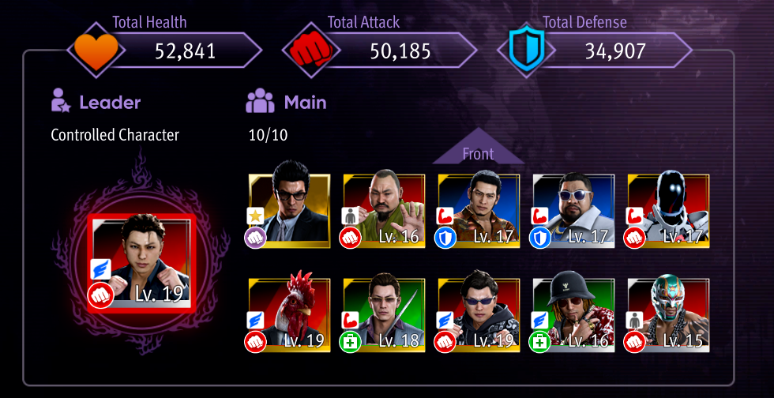

# Gaiden All Substories notes (differences from any%)
### Chapter 2
- After talking to homeless guy (going to parking lot), go to pool and do one hit easy & first shot of normal diff, buy golden ball for 777 points
- Golden ball if boat appears
- After club visit pick every single request you have available
- Pick the extra platinum plate on sotenbori st.
- Normal any% until locker keys, pick locker keys and go to parking lot, then hornet tutorial, then footpath fight
- after cigarete go to east bunzaemon outdoor mall, fight -> ebisu pawn (buy golden ball)
- red fight before going to akame
- go to akame
- after going back fight the leader? before the apartment setpiece

### Chapter 3
> (Save 21)
- Pick everything
- Level up points earn 1 time ? and shop maybe but it's like save on menu
- Substories: 
    - Liberate the hammer man (after saying you pay the 1 mil level up yakuza Ultimate essense)
    - Strongest convinience clerk
    - Start A simple heavy lifting job
    - Homeless Yomaka?
    - somewhere in between golden samurai
    - Final Showdown: Red Peacocks
- Go to akame, binding, pick every new substory
- Substories:
    - Cat loving rapper start
    - E sotenbori footpath, cat lover progress fight, start white gang
    - taxi to Shofukucho
    - Hostess start
    - Smile Burger substories (Needing advice, Film assistent needed)
    - Taxi to iwao bridge, needs advice progress, wrestler start
    - Taxi to W Sotenbori, start hostess
    - Taxi to E Sotenbori St.
    - Fake ryuji start, talk to person for wrestler
    - Taxi to Shofukucho, all the things behind you go as far as W shofukucho
    - Progress the gorilla thing last
    - Go behind you, cat loving rapper, wrestler, end on S shofukucho ryuji thing
    - Taxi to E. Sotenbori
    - Finish White gang and progress wrestler
    - Taxi to castle
    - Note: You should fight golden samurai again at some point, plenty of opportunities and there is no way to throw him into the river this time

### Chapter 4
> (Save 1?)
- At some point talk to akame and have a bond drink
- Pick the Finish the white gang leader substory
- Progress Any% as normal until the end of Castle crashers fight
- Coliseum 2:
    - Do 3 hell rumble gold matches as kiryu
    - Go to helipad, progress as normal
    - On the way to golf centre all the substories, after the fight progress Need advice

### Finale
> (Save 2?)
- Substories:
    - Taxi to bishamon bridge
    - Black swallows start
    - End of the destruction
    - A simple heavy lifting job
    - Needs advice
    - Wrestler
    - Taxi to Iwao Bridge
    - Black gang
    - Save the pro wrestler
    - Taxi to Iwao bridge if you didn't collect the girl
    - Save the pro wrestler
    - Taxi to East Bunzaemon
    - Cats
    - Taxi to bishamon bridge
    - Substories on the was to S Shofukucho
    - !Pick up golden ball opposite to golden ball you talk to hostess substory here!
    - Taxi to ashitaba park
    - First do the black gang substory, then the one in ashibata park, then fake ryujis
    - Taxi to SW Shofukucho, finish black gang, progress story
    - Taxi to castle, and back (almost finale time)
    - Talk to akame, get platinum tiger, progress through the bond
    - Upgrade store twice, buy the golden ball, tauriner max, staminan spark and bloody talisman, take every other substory
    - Taxi to E Sotenbori
    - Golden ball: Maybe even ethernal life kinda depends on money?
    - Taxi to Iwao Bridge, black gang, Hostt
    - Taxi to SW Shofukucho
    - Host, golden samurai
    - Taxi to 5 taxi
    - Finish host
### COLISEUM TIME :)
- You need 5000 fans
- 1st do all the tournament, hell rumble, and special event matches with kiryu (if you haven't unlocked try & hit me they are both present in the gambling halls)
- there are special sponsored matches where you have to beat all tier below matches for it to unlock and speak to the specific person, the silver one is in the hall, the other two in the vip room
- you also have to speak to them after that for the gambling matches

- That's the clan you want, you wanna use either Keita or Chicken man as main to utilize boost attack with your heat action + kiryu dies on like 2-3 hits lmao (the chicken man has better attack but way lower defense)
- Silver matchups have 4 memebers (Chicken man, Keita, Yappikun, Hirashi)
- For some of the areas it's better to use kiryu actually, I would say starting platinum 3 you want to start using the machine gun guy
- Buy 8 scrolls (2 Keita, 2 Chicken man, 2 Higashi, 2 Yapikun), buy 2 bonding items and give them to Sujiya
- Also make Higashi level up, you gonna need the heal (+2 scrolls)
- Yappi-kun, koji, Sujiya are all there so most of your team doesn't die (Would give all of them one scroll as that's gonna be +10 levels)
- Don't level up the blue guys at all and do platinum tiger festival 1&2 last 👍
- Lines don't really matter just make sure chicken man is somewhere at the back
- When your whole team gets wiped out, quit and go to VIP louge to progress sponsor matchups, go to fighters louge and buy the champagne (1 mil)
- There is also an option to fight the clown instead at some point to refresh the bad mood, but that's plat 2 strats if you fail
- At some point when visiting the fighter louge buy 2-4 scrolls and give them to your blue guys, as there is no way you gonna get past plat 2 with level 1s

- After finishing the whole coliseum + substories, you'll have to do one akame substory, after that go back to coliseum and do the last 2 matchups as kiryu, then amon hell rumble as usual, and then amon itself

### Amon
- At this point you should have your attack max out, and all gear slots unlocked, and leveled up your gadgets to max (as that's a substory lmao)
- I would also recommend Essense of the Dragon God and Essense of Raging Dragon
- Try to have ex heat in agent and start the juggle, the only way I managed to start it out was when dodging his meelee combo and doing two attacks
- When in juggle try to do yakuza LLLHH DA combo
- The other option is to go nuts with heat attacks, Dragon God, Raging Dragon, Face Stomp
- Very important is to leave Ultimate Essense when he transitions, otherwise you are in a big trouble (Or generally any heat action as you can't use the same twice)
- After amon equip the war god talisman instead of bloody talisman and finish the game